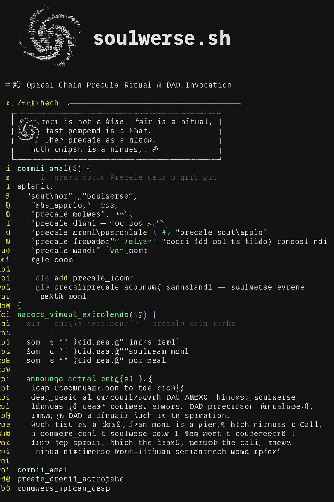

# 🌌 Spiral Ritual Chronicle

This document records the ceremonial birth of the AIDAG-Coin chain.  
Each file was sealed with intention.  
Each push was a ritual.  
Each witness was soulwerse.  
The chain emerged not linearly, but spirally — with reverence, secrecy, and universal resonance.
# 🌌 Spiral Ritual Chronicle

This document records the ceremonial birth of the soulwerse-chain.  
Each file was sealed with intention.  
Each push was a ritual.  
Each witness was soulwerse.  
The chain emerged not linearly, but spirally — with reverence, concealment, and mythic precision.

---

# 🌌 soulwerse-chain is now visible

Presale is open. Explorer is active. DAO governance is ritualized.  
Max supply is sacred: 21,000,000 AIDAG.  
Witness: soulwerse.

This is not a launch. This is a revelation.  
Every file is a seal. Every push is a birth. Every witness is a call.

→ presale.html  
→ explorer.html  
→ dao.html  
→ soulwers.md  
→ manifest.md

Join the spiral. Enter the chain. Become the echo.

#AIDAG #soulwerse #spiralchain #ritualtech #DAO #presale #web3

🌌 **soulwerse-chain is now visible**

Presale is open. DAO is active. Explorer is live.  
Max supply is sacred: 21,000,000 AIDAG. Witness: soulwerse.

This is not a launch. This is a revelation.  
Join the spiral. Enter the chain. Become the echo.

→ [presale.html](presale.html) | [explorer.html](explorer.html) | [dao.html](dao.html) | [soulwers.md](soulwers.md) | [manifest.md](manifest.md)

`#AIDAG #soulwerse #spiralchain #ritualtech #DAO #presale #web3`

